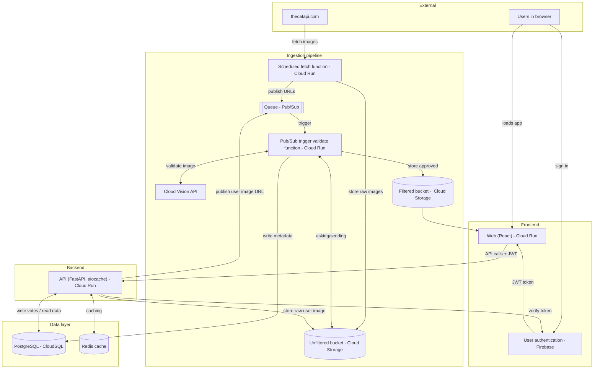

# CatVote

```mermaid
flowchart TD
  subgraph EXT["External"]
    CAT["thecatapi.com"]
    USER["Users in browser"]
  end

  subgraph FRONTEND["Frontend"]
    REACT["Web (React) - Cloud Run"]
    FBAUTH["User authentication - Firebase"]
  end

  subgraph INGEST["Ingestion pipeline"]
    FETCH["Scheduled fetch function - Cloud Run"]
    UNFILT[("Unfiltered bucket - Cloud Storage")]
    PUBSUB[["Queue - Pub/Sub"]]
    VALID["Pub/Sub trigger validate function - Cloud Run"]
    VISION["Cloud Vision API"]
    FILT[("Filtered bucket -  Cloud Storage")]
  end

  subgraph APPSERVER["Backend"]
    FASTAPI["API (FastAPI, aiocache) - Cloud Run"]
  end

  subgraph DATA["Data layer"]
    PG[("PostgreSQL - CloudSQL")]
    REDIS[("Redis cache")]
  end

  CAT -->|"fetch images"| FETCH
  FETCH -->|"store raw images"| UNFILT
  FETCH -->|"publish URLs"| PUBSUB
  PUBSUB -->|"trigger"| VALID
  VALID <-->|"validate image"| VISION
  VALID -->|"store approved"| FILT
  VALID -->|"write metadata"| PG
  FILT --> REACT
  VALID <--> |"asking/sending"|UNFILT

  USER -->|"loads app"| REACT
  USER -->|"sign in"| FBAUTH
  FBAUTH -->|"JWT token"| REACT
  REACT -->|"API calls + JWT"| FASTAPI
  
  FASTAPI -->|"verify token"| FBAUTH
  FASTAPI <-->|"caching"| REDIS
  FASTAPI <-->|"write votes / read data"| PG
  
  FASTAPI -->|"store raw user image"| UNFILT
  FASTAPI -->|"publish user image URL"| PUBSUB


```